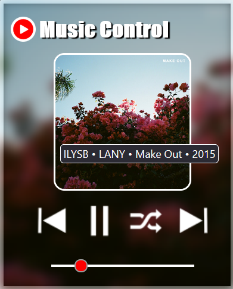
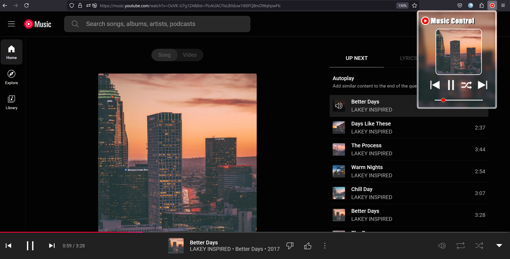

#  Youtube Music Control 

Access add-on page at: https://addons.mozilla.org/en-US/firefox/addon/youtube-music-control/?utm_source=addons.mozilla.org&utm_medium=referral&utm_content=search

Firefox addon to control active youtube music tab from any other tab.   
Features include:   
⋅ Play/pause track   
⋅ Go to next/previous track   
⋅ Change volume   
⋅ Display track name when hovering over album art   
⋅ Shuffle playlist     
 
          

   
TODO:  
⋅ Add queueing? 

 
